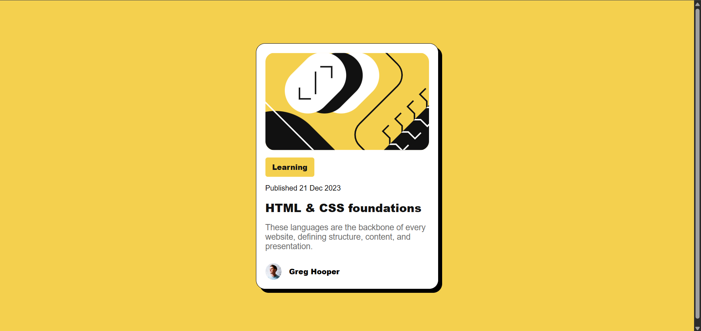

# Frontend Mentor - Blog Preview Card Solution

This is my solution to the Frontend Mentor Blog Preview Card challenge. The project helped me practice creating responsive card layouts, working with CSS styling, and improving attention to design details.

## Overview

### The Challenge

Users should be able to:

* View the blog preview card layout accurately
* See hover effects on interactive elements
* Experience a responsive design across different screen sizes

### Screenshot





### Links

* Solution URL: https://github.com/prabhjot-singh5/Blog-Preview-Card
* Live Site URL: https://prabhjot-singh5.github.io/Blog-Preview-Card/

## My Process

### Built With

* HTML5
* CSS3
* Flexbox
* Mobile-first workflow

### What I Learned

While building this project, I improved my understanding of:

* Flexbox alignment and positioning
* CSS custom properties (variables)
* Responsive design principles
* Creating hover states for better user interaction
* Matching a design as closely as possible from a reference image

Example CSS used for centering the card:

```css
body {
    display: flex;
    justify-content: center;
    align-items: center;
    min-height: 100vh;
}
```

### Continued Development

In future projects, I want to focus on:

* Improving responsive layouts
* Writing cleaner and more maintainable CSS
* Learning CSS Grid in greater depth
* Building projects faster while maintaining code quality

### AI Collaboration

I used ChatGPT during this project for:

* Debugging HTML and CSS issues
* Understanding layout concepts
* Learning better coding practices
* Reviewing and improving code structure

AI was helpful for finding mistakes quickly and explaining concepts, but I made sure to understand the solutions before applying them.

## Author

* Name: Prabhjot Singh
* Frontend Mentor: Add your Frontend Mentor profile link
* GitHub: Add your GitHub profile link

## Acknowledgments

Thanks to Frontend Mentor for providing realistic frontend challenges that help developers improve their practical skills.
